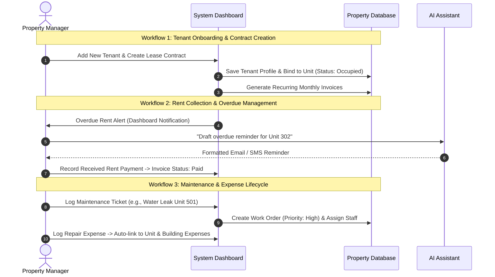

# PRODUCT DESIGN SPECIFICATION — APARTMENT MANAGEMENT SYSTEM (MVP SCOPE)

## 1. Product Vision & Philosophy

The **Apartment Management System** is a professional, web-based property operations platform built specifically for property managers, building administrators, and landlords.

Inspired by the visual clarity, cinematic dark tones, and editorial restraint of high-end design systems (such as Origin), this platform elevates property administration—from tenant onboarding and lease contracts to automated rent collection tracking, expense logging, work orders, and AI-assisted data querying.

---

## 2. Primary User & Roles

### Primary User: Property Manager / Building Administrator
Responsible for managing residential buildings, handling lease agreements, tracking rent collection, coordinating maintenance, and generating financial reports.

### Practical MVP Role-Based Access Control (RBAC):
1. **Property Admin / General Manager**: Full access across buildings, financials, staff assignments, reports, and AI capabilities.
2. **Operations Manager**: Full access to Buildings, Units, Tenants, Contracts, Maintenance, and Documents; read-only access to financial summaries.
3. **Maintenance Technician / Staff**: Access to view assigned Work Orders and log repair notes/expenses.
4. **Accountant / Financial Clerk**: Access to Rent & Payments, Expenses, Invoices, and Reports modules.

---

## 3. Main Workflows



---

## 4. Information Architecture (IA)

```
[Top Bar]: Global Search | Building Switcher | AI Copilot Toggle | Notifications Bell | Admin Profile
 └── [Sidebar Navigation]
      ├── 📊 Dashboard (Overview & Operational Command Center)
      ├── 🏢 Buildings (Property Portfolio & Floor Maps)
      ├── 🚪 Apartments / Units (Unit Directory & Status Tracker)
      ├── 👥 Tenants / Residents (Resident Directory & Profiles)
      ├── 📜 Contracts (Lease Agreements & Expirations)
      ├── 💳 Rent & Payments (Invoices, Payment Logs, Collections)
      ├── 💸 Expenses (Operational Expenses & Utility Logs)
      ├── 🛠️ Maintenance (Work Orders & Service Requests)
      ├── 📁 Documents (Lease Files, IDs, Building Regulations)
      ├── 📈 Reports (Rent Roll, P&L, Occupancy & Maintenance Reports)
      ├── 🔔 Notifications (System Alerts & Overdue Notices)
      └── 🤖 AI Assistant (Property Data Query & Copilot Panel)
```

---

## 5. Detailed UX Structure for Key Screens

### Screen 1: Dashboard (Operational Command Center)
- **Purpose**: Provide property managers with an immediate, calm, and authoritative overview of portfolio performance, revenue velocity, and urgent operational alerts.
- **Layout**: Top metric grid (4 summary cards) -> Main split layout: Left side (Monthly Revenue SVG chart & Rent Collection progress bar), Right side (Urgent Operations Feed: expiring contracts, overdue rent, high-priority maintenance).
- **Important Components**:
  - *Key Metric Cards*: Total Occupancy Rate (%), Rent Collected ($), Overdue Amount ($), Active Tickets.
  - *Revenue & Cashflow Chart*: Smooth SVG area chart with soft amber glow gradient fill.
  - *Urgent Action Feed*: Cards highlighting items requiring immediate attention with direct action buttons (*"Remind Tenant"*, *"Dispatch Tech"*).
- **Primary Actions**: *+ Add Tenant*, *+ Record Payment*, *+ Issue Work Order*, *Open AI Copilot*.
- **Distinctive Visual Treatment**: Cinematic greeting header with live clock, dark glass cards with top status accent strokes, ambient background radial light orbs.

---

### Screen 2: Building Overview
- **Purpose**: Display property portfolio assets, floor-by-floor breakdown, occupancy health, and associated building expenses.
- **Layout**: Top Property Card (Photo hero, address, total floors, total units, assigned manager) -> Tabbed Navigation (*Floor Matrix*, *Units List*, *Expenses*, *Documents*) -> Building Floor Plan Grid.
- **Important Components**:
  - *Building Hero Header*: Large editorial property card with ambient glow and quick metric badges.
  - *Floor Elevation Matrix*: Interactive visual map of floors (T24 to T1) displaying unit boxes colored by status (*Occupied*, *Vacant*, *Maintenance*, *Reserved*).
  - *Building Financial Breakdown*: Expense summary card tied specifically to this building.
- **Primary Actions**: *+ Add Unit to Building*, *Filter by Floor*, *Export Rent Roll*.
- **Distinctive Visual Treatment**: Floor-by-floor vertical elevation index with understated status indicator lights and subtle hover expansion cards.

---

### Screen 3: Apartment / Unit Detail (✨ Signature Product Screen)
- **Purpose**: Serve as the flagship visual experience of the product—a high-density, cinematic inspection view for an individual apartment unit, binding together specs, current tenant profile, lease contract details, payment history, and maintenance log.
- **Layout**: Header Banner (Unit ID `PH-2401`, Floor level, Unit Type, Sqm, View Horizon) -> 3-Column Hero Layout:
  - *Column 1 (Left - 35%)*: Unit Specifications & Status Badge (*Occupied* emerald pulse card), Base Rent, Floor Plan Spec, Views.
  - *Column 2 (Center - 40%)*: Resident & Contract Spotlight (Active tenant avatar, contact info, lease start/end, deposit status, payment auto-pay badge).
  - *Column 3 (Right - 25%)*: Quick Operations Panel (Active maintenance tickets, recent payment ledger, quick action buttons).
- **Important Components**:
  - *Unit Header Badge*: Large editorial typography displaying `PH-2401` in Cinzel serif font with metallic amber outline.
  - *Resident Spotlight Card*: High-contrast glass card featuring tenant photo, verified identity badge, lease countdown progress bar.
  - *Unit Quick Actions*: Buttons to *Generate Access Token*, *Send Payment Reminder*, *Create Maintenance Work Order*, *Renew Lease*.
- **Primary Actions**: *Edit Unit Specs*, *View Full Lease PDF*, *Issue Maintenance Ticket*, *Log Rent Payment*.
  - **Distinctive Visual Treatment**: This screen is the product's visual signature. It features a dark obsidian background with an ambient golden glow backdrop, micro glass borders (`1px border-white/10`), floating status badges, and smooth tab transitions for switching between specs, financial history, and repair logs.

---

### Screen 4: Tenant Detail
- **Purpose**: Manage resident identity, contact info, registered occupants, active/past lease contracts, payment reliability score, and uploaded ID documents.
- **Layout**: Split Profile Header (Tenant Avatar, Full Name, Contact Info, Emergency Contact, Reliability Rating Badge) -> Tabbed Content (*Active Contract*, *Payment History*, *Work Orders Log*, *Documents & ID Files*).
- **Important Components**:
  - *Payment Reliability Meter*: Gauge indicator showing on-time payment track record (e.g., 98% On-Time).
  - *Emergency Contact Card*: High-visibility card with quick call/email action triggers.
  - *Associated Documents List*: Downloadable PDF links for Tenant ID, Signed Lease Contract, Rules Agreement.
- **Primary Actions**: *Edit Tenant Profile*, *Contact Tenant*, *Create Contract*, *Upload Document*.
- **Distinctive Visual Treatment**: Clean, editorial profile view with monospace phone/email formatting, glass surface containers, and emerald verification badges.

---

### Screen 5: Payments & Rent Ledger
- **Purpose**: Provide full financial transparency over monthly rent invoicing, collection velocity, partial payments, and overdue tracking.
- **Layout**: Top Financial Summary Strip (Collected This Month, Pending Invoices, Overdue Total) -> Filter Bar (*Status*, *Building*, *Date Range*) -> Financial Invoices Data Table -> Slide-over Payment Recording Drawer.
- **Important Components**:
  - *Invoice Table*: Monospaced amounts, status tags (*Paid*, *Unpaid*, *Overdue*, *Partial*), quick payment logging trigger button per row.
  - *Record Payment Drawer*: Slide-in glass form to record cash, bank transfer, or card payments with reference numbers.
  - *Overdue Highlight Bar*: Muted rose alert box summarizing late payments requiring action.
- **Primary Actions**: *Record Payment*, *Generate Monthly Invoices*, *Send Overdue Reminders*, *Export Cash Flow CSV*.
- **Distinctive Visual Treatment**: Dense, high-readability financial data table with subtle row hover highlights, monospaced numeric formatting, and glowing status tags.

---

### Screen 6: Maintenance Work Orders
- **Purpose**: Track, assign, and resolve property maintenance requests and repair expenses.
- **Layout**: Top Toggle View (*Kanban Board View* vs *Table List View*) -> Filter Bar (*Priority*, *Category*, *Status*) -> Kanban Columns (*Open*, *In Progress*, *Resolved*).
- **Important Components**:
  - *Work Order Cards*: Priority indicator badge (*Urgent* rose tag, *Medium* amber tag), unit ID, issue category icon, assigned technician avatar, reported time.
  - *New Work Order Modal*: Form to input unit number, title, priority, assigned staff, and estimated repair cost.
- **Primary Actions**: *+ New Work Order*, *Drag Card to Update Status*, *Assign Staff*, *Log Repair Expense*.
- **Distinctive Visual Treatment**: Drag-and-drop glass cards with priority border highlights, category icon badges, and smooth column movement transitions.

---

### Screen 7: AI Property Assistant (Copilot Drawer)
- **Purpose**: Provide property managers with a natural-language copilot to query property data, summarize overdue rent, analyze maintenance trends, and draft tenant notices.
- **Layout**: Slide-over Drawer (380px width) anchored to the right side of the screen -> Header (AI Copilot mark, model indicator, close button) -> Scrollable Message Feed -> Quick Prompt Chips -> Input Box.
- **Important Components**:
  - *Quick Prompt Chips*: *"Summarize overdue rent"*, *"Draft payment reminder for Unit 302"*, *"Show expiring leases in 60 days"*.
  - *Structured AI Response Cards*: Formatted data tables and direct action buttons embedded inside chat messages.
  - *Interactive Action Triggers*: Buttons inside AI responses allowing one-click execution (e.g., *"Send Drafted Reminder"*).
- **Primary Actions**: *Query Data*, *Draft Tenant Message*, *Export Summary*, *Clear Chat*.
- **Distinctive Visual Treatment**: Deep amethyst glow theme (`border-purple-500/30`), typewriter response text effect, and embedded glass data cards inside messages.

---

## 6. Important Entities & Data Schema Summary

1. **`Building`**: `id`, `name`, `address`, `totalFloors`, `totalUnits`, `managerName`, `createdAt`.
2. **`Unit`**: `id`, `buildingId`, `unitNumber`, `floor`, `type`, `sqm`, `bedrooms`, `bathrooms`, `baseRentUSD`, `status`.
3. **`Tenant`**: `id`, `fullName`, `phone`, `email`, `emergencyContact`, `idDocumentNumber`, `createdAt`.
4. **`Contract`**: `id`, `unitId`, `tenantId`, `startDate`, `endDate`, `monthlyRentUSD`, `depositUSD`, `paymentDueDay`, `status`.
5. **`Invoice`**: `id`, `contractId`, `periodMonth`, `periodYear`, `amountDueUSD`, `amountPaidUSD`, `dueDate`, `status`.
6. **`Payment`**: `id`, `invoiceId`, `amountUSD`, `paymentDate`, `paymentMethod`, `transactionRef`.
7. **`Expense`**: `id`, `buildingId`, `unitId` (optional), `category`, `amountUSD`, `vendorName`, `expenseDate`, `receiptFileUrl`.
8. **`WorkOrder`**: `id`, `unitId`, `category`, `title`, `description`, `priority`, `status`, `assignedStaff`, `costUSD`, `reportedAt`.
9. **`Document`**: `id`, `relatedEntityType` (`Contract`, `Tenant`, `Building`), `entityId`, `fileName`, `fileUrl`, `fileType`, `uploadedAt`.
10. **`Notification`**: `id`, `type`, `title`, `message`, `isRead`, `createdAt`.

---

## 7. Non-Goals (Explicitly Excluded from MVP Scope)

To keep the project focused, realistic, and achievable while maintaining professional depth, the following enterprise features are **EXCLUDED**:
- ❌ Resident-facing mobile apps or resident self-service login portals.
- ❌ IoT / Smart Lock hardware integrations & telemetry.
- ❌ Luxury concierge, valet, or sky amenity booking engines.
- ❌ 3D WebGL isometric building renders.
- ❌ Complex real estate investment yield / capitalization modeling.
- ❌ Automated payment gateway / bank API integrations (payments are logged administratively).
