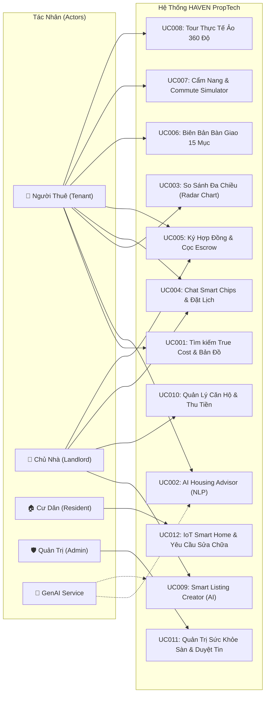

# TÀI LIỆU ĐẶC TẢ YÊU CẦU PHẦN MỀM (SRS)

**Tên ứng dụng**: Hệ thống Nền tảng PropTech Cho Thuê & Quản Lý Căn Hộ Tích Hợp Trí Tuệ Nhân Tạo (HAVEN)  
**Mã dự án**: HAVEN-PROPTECH-K23A  
**Môn học**: Ứng dụng Trí tuệ Nhân tạo trong Phát triển Phần mềm (KHMT K23A)  
**Phiên bản**: 1.0 (Bản Phát hành Hoàn chỉnh)  
**Nhóm sinh viên thực hiện**:
1. **Vũ Ngọc Sơn** (Trưởng nhóm, Kiến trúc hệ thống & Fullstack)
2. **Vũ Bảo Linh** (Kỹ sư Dữ liệu & Tích hợp AI Engine)
3. **Tô Văn Quyền** (Kiểm thử Phần mềm & Đặc tả Nghiệp vụ)
4. **Lê Bình Nguyên** (Thiết kế Giao diện UI/UX & Tài liệu Học thuật)

---

## 1. GIỚI THIỆU CHUNG

### 1.1 Mục Đích
Tài liệu Đặc tả Yêu cầu Phần mềm (Software Requirements Specification - SRS) này mô tả toàn diện, chi tiết và có hệ thống các yêu cầu chức năng, phi chức năng, các ràng buộc kỹ thuật và mô hình thiết kế của hệ thống **HAVEN PropTech Platform**. Tài liệu đóng vai trò là cơ sở kỹ thuật thống nhất cho các thành viên phát triển, kiểm thử viên và giảng viên đánh giá môn học.

### 1.2 Phạm Vi & Đối Tượng Phục Vụ
- **Phạm vi**: Nền tảng PropTech web ứng dụng đa phân hệ dành cho thị trường thuê và cho thuê căn hộ tại các đô thị lớn tại Việt Nam (16 thành phố: Hà Nội, TP. Hồ Chí Minh, Đà Nẵng, Hải Phòng, Bình Dương, Nha Trang, Cần Thơ, Vũng Tàu, Hạ Long, Đà Lạt, Huế, Quy Nhơn, Biên Hòa, Vinh, Thanh Hóa, Buôn Ma Thuột).
- **Đối tượng phục vụ**:
  - Người thuê nhà cá nhân (Sinh viên, Người đi làm, Gia đình trẻ, Chuyên gia nước ngoài / Expat).
  - Chủ nhà cá nhân và Ban quản lý tòa nhà cho thuê.
  - Cư dân đang sinh sống tại căn hộ.
  - Quản trị viên sàn thương mại bất động sản.

### 1.3 Thuật Ngữ & Từ Viết Tắt
| STT | Thuật ngữ / Từ viết tắt | Giải thích chi tiết | Ghi chú |
| :---: | :--- | :--- | :--- |
| 1 | **PropTech** | Property Technology — Ứng dụng công nghệ số vào lĩnh vực bất động sản. | Khái niệm ngành |
| 2 | **True Cost** | Tổng chi phí thực tế hàng tháng = Tiền thuê gốc + Điện + Nước + Quản lý + Gửi xe + Internet. | Nghiệp vụ cốt lõi |
| 3 | **PCCC (QCVN 06)** | Quy chuẩn kỹ thuật quốc gia về an toàn cháy cho nhà và công trình (QCVN 06:2022/BXD). | Pháp lý an toàn |
| 4 | **Escrow** | Cơ chế tạm giữ tiền ký quỹ bảo chứng giao dịch thông qua bên thứ ba trung gian. | An toàn tiền cọc |
| 5 | **Trust Score** | Điểm tín nhiệm chủ nhà được tính toán tự động trên thang 1.0 - 5.0★ từ dữ liệu giao dịch. | Minh bạch sàn |
| 6 | **GenAI** | Generative Artificial Intelligence — Trí tuệ nhân tạo tạo sinh hỗ trợ tư vấn và soạn tin. | Công nghệ AI |

### 1.4 Tài Liệu Tham Khảo
1. *Tài liệu Kế hoạch Dự án*: `01_GenAI_SoftwareDevelopment_project-plan.docx`.
2. *Tài liệu Thu thập Yêu cầu*: `02_GenAI_SoftwareDevelopment_requirements-qa.docx`.
3. *Quy chuẩn Kỹ thuật Quốc gia QCVN 06:2022/BXD* của Bộ Xây Dựng.
4. *Nghiên cứu Sản phẩm HAVEN PropTech Suite* (Part 1, Part 2, Part 3).

---

## 2. MÔ TẢ TỔNG QUAN ỨNG DỤNG

### 2.1 Danh Sách Các Tác Nhân (Actors)
| Tác nhân | Mô tả vai trò | Đặc quyền trong hệ thống |
| :--- | :--- | :--- |
| **Người Thuê (Tenant)** | Người dùng có nhu cầu tìm kiếm, thuê phòng, ký hợp đồng và sử dụng dịch vụ cư dân. | Tìm kiếm True Cost, xem bản đồ PCCC/ngập lụt, so sánh radar, chat, ký hợp đồng E-Sign, cọc Escrow. |
| **Chủ Nhà (Landlord)** | Cá nhân hoặc tổ chức sở hữu/quản lý căn hộ cho thuê trên sàn. | Đăng tin bằng AI, quản lý phòng, tiếp nhận lead, tạo hợp đồng, quản lý hóa đơn thu tiền. |
| **Cư Dân (Resident)** | Người đang trực tiếp sinh sống trong căn hộ thuê. | Điều khiển thiết bị IoT, gửi yêu cầu sửa chữa/bảo trì, thanh toán hóa đơn, đặt lịch tiện ích. |
| **Quản Trị Sàn (Marketplace Admin)**| Đội ngũ vận hành và kiểm duyệt của nền tảng HAVEN. | Xem bảng sức khỏe sàn, duyệt tin đăng, gắn cờ tin ảo, giải quyết tranh chấp cọc. |
| **Hệ Thống GenAI (AI Engine)** | Dịch vụ AI tích hợp xử lý ngôn ngữ tự nhiên và thị giác máy tính. | Phân tích intent tìm kiếm (NLP), nhận diện layout phòng từ ảnh, sinh tiêu đề SEO và gợi ý giá. |

### 2.2 Sơ Đồ Use Case Tổng Quát (General Use Case Diagram)

---

## 3. ĐẶC TẢ CHI TIẾT CÁC USE CASE CỐT LÕI

### 3.1 Use Case UC001: Tìm Kiếm Căn Hộ & Bản Đồ PCCC/Ngập Lụt
- **Mục tiêu**: Người thuê tìm kiếm căn hộ theo ngân sách thực tế và kiểm tra an toàn PCCC, ngập lụt đô thị.
- **Tác nhân**: Người Thuê (Tenant).
- **Điều kiện tiên quyết**: Người dùng truy cập ứng dụng HAVEN.
- **Điều kiện hoàn thành**: Danh sách căn hộ phù hợp được hiển thị cùng chiết tính True Cost và lớp bản đồ an toàn.
- **Luồng sự kiện chính**:
  1. Người thuê chọn thành phố (trong 16 thành phố) và phân khúc giá.
  2. Người thuê bật các lớp an toàn (PCCC đạt chuẩn QCVN 06, không ngập lụt khi triều cường, có chỗ đỗ ô tô).
  3. Hệ thống trả về danh sách căn hộ theo thời gian thực.
  4. Người thuê xem biểu đồ True Cost và chuyển tab Bản Đồ để xem chi tiết rủi ro khu vực.

### 3.2 Use Case UC009: Đăng Tin Tự Động Bằng AI (Smart Listing Creator)
- **Mục tiêu**: Chủ nhà xuất bản tin đăng hoàn chỉnh trong 60 giây nhờ trí tuệ nhân tạo.
- **Tác nhân**: Chủ Nhà (Landlord), Hệ thống GenAI Engine.
- **Điều kiện tiên quyết**: Chủ nhà đăng nhập vào giao diện Quản trị.
- **Luồng sự kiện chính**:
  1. Chủ nhà tải lên 3-8 ảnh thực tế của căn hộ và chọn vị trí.
  2. AI phân tích nhận diện loại phòng, không gian nội thất.
  3. AI tự động sinh tiêu đề chuẩn SEO, mô tả hấp dẫn và gợi ý khoảng giá thuê tối ưu.
  4. Chủ nhà xác nhận và tin đăng được gắn nhãn Verified sau khi kiểm định.

---

## 4. BẢNG MA TRẬN TRUY VẾT YÊU CẦU (REQUIREMENTS TRACEABILITY MATRIX)

| Mã Yêu Cầu | Tên Chức Năng | Use Case Liên Quan | Thành Phần Kỹ Thuật (Components) | Trạng Thái Kiểm Thử |
| :---: | :--- | :---: | :--- | :---: |
| **FR-01** | Tìm kiếm AI bằng ngôn ngữ tự nhiên | UC002 | `services/aiAdvisorService.ts`, `UserSearchView.tsx` | Đạt (Passed) |
| **FR-02** | Bảng chiết tính True Cost Breakdown | UC001 | `ApartmentDetailModal.tsx`, `TrueCostCalculator.tsx` | Đạt (Passed) |
| **FR-03** | Bản đồ PCCC & Ngập lụt Đa Lớp | UC001 | `ConfidenceMapView.tsx` | Đạt (Passed) |
| **FR-04** | So sánh đa chiều (Radar Chart 5 trục) | UC003 | `UserCompareView.tsx` | Đạt (Passed) |
| **FR-05** | Đăng tin thông minh bằng AI | UC009 | `LandlordSmartListingModal.tsx` | Đạt (Passed) |
| **FR-06** | Hợp đồng điện tử E-Sign & Escrow | UC005 | `LeaseContractModal.tsx`, `EscrowDepositModal.tsx` | Đạt (Passed) |
| **FR-07** | Biên bản bàn giao 15 mục có ảnh | UC006 | `HandoverChecklistView.tsx` | Đạt (Passed) |
| **FR-08** | Cẩm nang khu vực & Commute Simulator | UC007 | `NeighborhoodGuideView.tsx` | Đạt (Passed) |
| **FR-09** | Quản lý danh mục phòng & Sơ đồ tầng | UC010 | `LandlordUnitListView.tsx`, `FloorPlanManagerView.tsx`| Đạt (Passed) |
| **FR-10** | Quản trị sàn & Bảng sức khỏe thị trường | UC011 | `AdminDashboardView.tsx`, `MarketHealthView.tsx` | Đạt (Passed) |
| **FR-11** | IoT Smart Home & Yêu cầu bảo trì | UC012 | `ResidentPortalView.tsx`, `MaintenanceTicketModal.tsx` | Đạt (Passed) |
