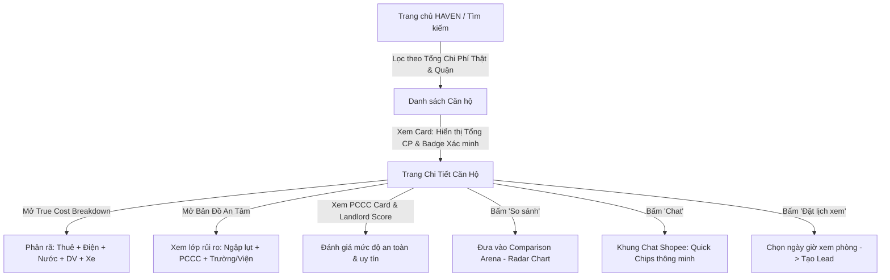
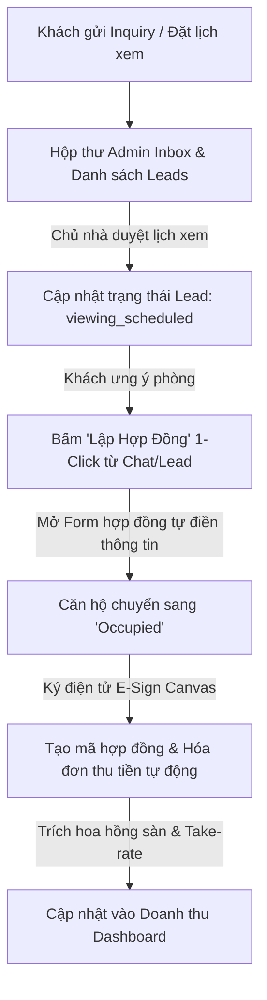

# HAVEN — Kiến Trúc Luồng Trải Nghiệm (UX Flows & State Architecture)

> **Mục tiêu**: Đảm bảo mọi luồng thao tác của Người thuê (Consumer), Chủ nhà (Landlord) và Ban quản trị (Admin) đều liền mạch, có đầy đủ các trạng thái tương tác và responsive trên mọi thiết bị.

---

## 1. LUỒNG TRẢI NGHIỆM CHÍNH CỦA NGƯỜI THUÊ (CONSUMER JOURNEYS)

### 1.1 Luồng Khám Phá & Đánh Giá "Biết Rõ Trước Khi Cọc"

### 1.2 Luồng Nhắn Tin Tương Tác & Tự Động Hóa (Shopee-Style Chat)
1. **Khách thuê** bấm nút chat nổi hoặc tại trang chi tiết.
2. Hệ thống mở `ChatModal`:
   - Hiển thị lời chào tự động và tóm tắt thông tin căn phòng (Giá thuê, Tổng chi phí, Địa chỉ).
   - Tự động hiển thị 3 **Smart Question Chips** phù hợp với các thông tin căn hộ chưa khai báo (Ví dụ: *"Nuôi thú cưng được không?"*, *"Chỗ đỗ ô tô có sẵn không?"*, *"Chính sách hoàn cọc ra sao?"*).
3. Khi khách chọn câu hỏi nhanh:
   - Hệ thống phản hồi tự động sau 800ms dựa trên dữ liệu thật của căn phòng.
4. Đoạn chat được lưu vào Central Reactive Store (`localStorage`) và đồng bộ tức thì sang hộp thư của Chủ nhà (`AdminInboxView`).

### 1.3 Luồng Đấu Trường So Sánh (Comparison Arena)
1. Khách bấm nút **"Thêm vào so sánh"** tại 2 hoặc 3 căn hộ bất kỳ.
2. Mở màn hình `UserCompareView`:
   - **Bảng so sánh song song**: Tổng chi phí thực tế, Giá thuê danh nghĩa, Rủi ro ngập, Chỉ số PCCC, Diện tích, Tiện ích nội khu.
   - **Biểu đồ Radar Chart 5 chiều**: Trực quan hóa tương quan giữa các căn hộ.
   - **AI Recommendation Box**: Tóm tắt căn hộ có tỷ lệ giá/chất lượng an toàn tốt nhất cho khách.

---

## 2. LUỒNG TRẢI NGHIỆM CỦA CHỦ NHÀ & QUẢN TRỊ (ADMIN & OPERATIONS JOURNEYS)

### 2.1 Luồng Xử Lý Khách & Chốt Hợp Đồng 1-Click

---

## 3. QUẢN LÝ TRẠNG THÁI GIAO DIỆN (UI STATES MANAGEMENT)

Mọi màn hình và component bắt buộc tuân thủ 5 trạng thái:

| Trạng thái | Yêu cầu thiết kế | Ví dụ thực tế |
|---|---|---|
| **1. Loading State** | Skeleton shimmer effect chuẩn kính mờ nhám Liquid Glass, không để màn hình trắng hoặc giật layout. | Card tìm kiếm hiển thị khung xám mờ phát sáng chạy hiệu ứng gradient. |
| **2. Empty State** | Minh họa đồ họa SVG, giải thích nguyên nhân kèm nút kêu gọi hành động (CTA) rõ ràng. | Trang so sánh chưa có căn hộ: *"Chưa có căn nào được chọn — [Khám phá ngay]"*. |
| **3. Error State** | Thông báo lỗi tiếng Việt thân thiện, nút "Thử lại" hoặc liên hệ hỗ trợ. | Không tải được dữ liệu bản đồ: *"Không thể tải lớp dữ liệu ngập — [Tải lại lớp bản đồ]"*. |
| **4. Success State** | Toast thông báo viền ngọc lục bảo (Emerald Glow), icon check tròn nổi bật. | Đặt lịch xem phòng thành công: *"Lịch xem phòng lúc 15:00 ngày mai đã được gửi tới chủ nhà"*. |
| **5. Partial Data State** | Xử lý khuyết thông tin bằng nhãn *"Chưa có dữ liệu xác minh"* thay vì để trống hoặc báo lỗi code. | Căn hộ chưa kiểm tra PCCC: hiển thị huy hiệu vàng *"Đang cập nhật hồ sơ PCCC"*. |

---

## 4. CHIẾN LƯỢC RESPONSIVE (MOBILE-FIRST BREAKPOINTS)

- **Mobile (< 768px)**:
  - Thanh điều hướng chuyển xuống đáy màn hình (Bottom Navigation Bar).
  - Bản đồ và danh sách chuyển sang dạng Tabs chuyển đổi (Toggle Map / List View).
  - Bảng so sánh chuyển sang dạng vuốt ngang (Horizontal Swipe Cards).
- **Tablet (768px - 1024px)**:
  - Sidebar dạng thu nhỏ (Collapsed Icon Bar).
  - Lưới danh sách 2 cột.
- **Desktop (> 1024px)**:
  - Toàn bộ giao diện 2-3 cột chuẩn Liquid Glass UI sang trọng, sidebar mở rộng đầy đủ.
